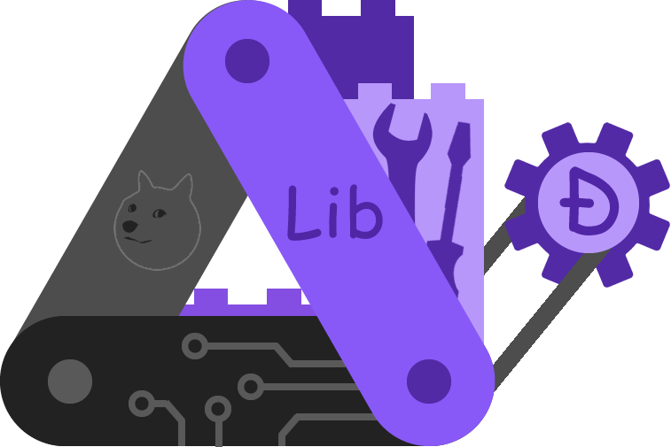

<p align="center">
  
</p>

# libdogecoin Documentation

This repository contains the documentation for [libdogecoin](https://lib.dogecoin.org) — a clean C library of Dogecoin building blocks.

The site is built with [Fumadocs](https://www.fumadocs.dev/) (Next.js + MDX), with a flat structure at the repo root (similar to [radiodoge-docs](https://github.com/dogecoinfoundation/radiodoge-docs)).

---

## Run locally

```bash
pnpm install
pnpm dev
```

Open [http://localhost:3000](http://localhost:3000). Docs are at [http://localhost:3000/docs](http://localhost:3000/docs).

## Build for production

```bash
pnpm install
pnpm build
```

Static output is in `.next`. For static export (e.g. GitHub Pages), the deploy workflow sets `OUTPUT_EXPORT=1` and the site is built to `out/`.

---

## How to improve the documentation

We welcome contributions. Follow these steps to clone the repo, run the site, make changes, and test them on **Windows**, **macOS**, or **Linux**.

### 1. Prerequisites

You need **Node.js** (v18 or v20 recommended) and **pnpm**.

| Platform | Install Node.js | Install pnpm |
|----------|-----------------|--------------|
| **Windows** | Download the LTS installer from [nodejs.org](https://nodejs.org/) and run it. Or use [nvm-windows](https://github.com/coreybutler/nvm-windows): `nvm install 20` then `nvm use 20`. | After Node is installed, open PowerShell or Command Prompt and run: `npm install -g pnpm` |
| **macOS** | Use [Homebrew](https://brew.sh/): `brew install node`. Or [nvm](https://github.com/nvm-sh/nvm): `nvm install 20` then `nvm use 20`. | `npm install -g pnpm` (or `brew install pnpm`) |
| **Linux** | Use your package manager (e.g. `sudo apt install nodejs npm` on Ubuntu) or [nvm](https://github.com/nvm-sh/nvm): `nvm install 20` then `nvm use 20`. | `npm install -g pnpm` |

Check that it worked:

```bash
node -v    # e.g. v20.x.x
pnpm -v    # e.g. 10.x.x
```

### 2. Copy (clone) the repository

**All platforms (Git must be installed):**

```bash
# Clone the repo (use HTTPS or SSH)
git clone https://github.com/dogeorg/libdogecoin-docs.git
cd libdogecoin-docs
```

- **Windows:** Use Git Bash, PowerShell, or Command Prompt. If Git is not installed, install [Git for Windows](https://git-scm.com/download/win).
- **macOS:** Git is often pre-installed; otherwise run `xcode-select --install` or install Xcode Command Line Tools.
- **Linux:** Install Git if needed, e.g. `sudo apt install git` (Ubuntu/Debian) or `sudo dnf install git` (Fedora).

### 3. Install dependencies

From the repo root (`libdogecoin-docs`):

```bash
pnpm install
```

This installs Next.js, Fumadocs, and other dependencies. The first run may take a minute.

### 4. Run the development server and test the site

Start the dev server:

```bash
pnpm dev
```

- **Windows:** In PowerShell or Command Prompt, run the command. You may see a firewall prompt; allow Node if you want to open the site from another device on your network.
- **macOS / Linux:** Same command in Terminal.

Then:

1. Open a browser and go to **http://localhost:3000**.
2. Check the home page and click **Docs** (or go to http://localhost:3000/docs).
3. Use the sidebar to open a few doc pages and confirm they load.

Leave the server running while you edit; the page will hot-reload when you save files.

### 5. Make your changes

- **Edit or add doc pages:** MDX files in `content/docs/`, e.g. `content/docs/what.mdx`.
- **Change sidebar order or labels:** Edit `content/docs/meta.json`.
- **Add or replace images:** Put files in `public/img/` and reference them in MDX as `/img/your-image.png`.
- **Edit the landing page:** See `app/(home)/page.tsx` and components in `components/home/`.
- **Edit layout or navigation:** See `components/layout/` and `app/layout.tsx`.

Use normal Markdown and [MDX](https://mdxjs.com/) in `.mdx` files (including JSX components if needed). Save the file and confirm the change in the browser.

### 6. Test the production build (optional but recommended)

Stop the dev server (Ctrl+C), then run:

```bash
pnpm build
```

- **Windows:** In the same terminal, press Ctrl+C to stop `pnpm dev`, then run `pnpm build`.
- **macOS / Linux:** Same.

If the build finishes without errors, your changes are fine for production. You can run `pnpm start` to serve the production build locally.

### 7. Submit your improvements

1. **Fork** the repo on GitHub (click **Fork** on the [libdogecoin-docs](https://github.com/dogeorg/libdogecoin-docs) page).
2. **Create a branch** in your fork (e.g. `git checkout -b docs-fix-typo`).
3. **Commit** your changes (e.g. `git add .` then `git commit -m "Fix typo in what.mdx"`).
4. **Push** to your fork (e.g. `git push origin docs-fix-typo`).
5. **Open a Pull Request** from your branch to `main` on the original repo. Describe what you changed and why.

Maintainers will review and merge. Thank you for helping improve the docs.

---

## Edit content (quick reference)

| What | Where |
|------|--------|
| MDX doc pages | `content/docs/*.mdx` |
| Sidebar order & labels | `content/docs/meta.json` |
| Images | `public/img/` (use in MDX as `/img/filename.png`) |

## Project structure

| Path | Description |
|------|-------------|
| `app/(home)` | Landing page and home layout |
| `app/docs` | Documentation layout and pages |
| `app/api/search` | Search API route |
| `components/` | React components (layout, home) |
| `content/docs` | MDX docs and meta |
| `lib/` | Source, layout shared options |
| `styles/` | Global CSS |

## GitHub Actions

- **Deploy** (`.github/workflows/deploy.yml`): on push to `main`/`master`, builds a static export and deploys to GitHub Pages.

To publish via GitHub Pages: go to the repo **Settings → Pages**, set **Source** to **GitHub Actions**. After the next push to `main`, the site will be built and deployed. With a `CNAME` file (e.g. `lib.dogecoin.org`), Pages will serve the site on that domain.

## Links

- **Live docs:** [lib.dogecoin.org](https://lib.dogecoin.org)
- **libdogecoin repo:** [github.com/dogecoinfoundation/libdogecoin](https://github.com/dogecoinfoundation/libdogecoin)
- **Fumadocs:** [fumadocs.dev](https://www.fumadocs.dev/)
